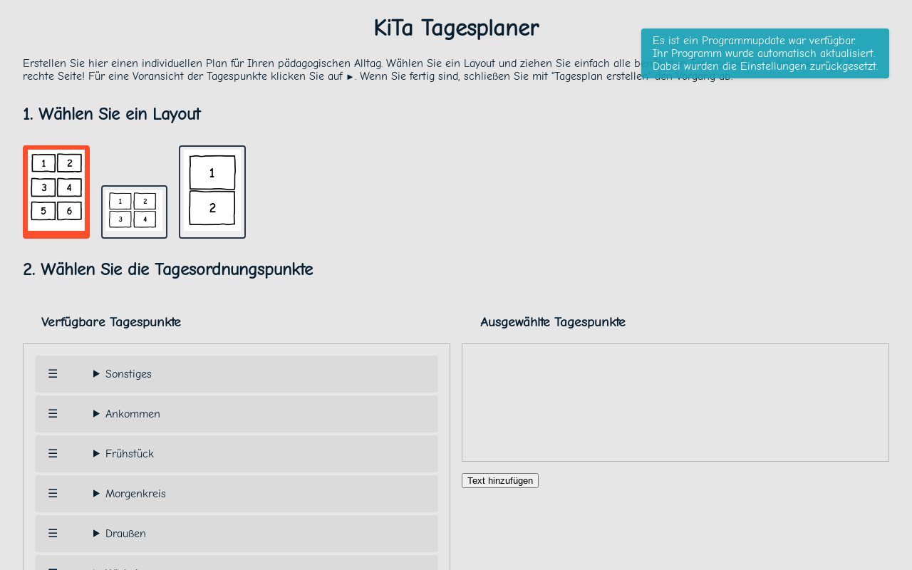

# Dayplanner APP (PWA)



## Description

This is a day planner app that allows users to plan their day in Kindergarten by adding events and tasks.

## Features

- Add events and tasks to the day planner
- Edit the order for events and tasks
- Delete events and tasks
- Add custom text
- Choose between different layouts
- Build the PDF of the day planner

## Environments

| Name | Url |
| ---- | --- |
| Development | <https://localhost:8080> |
| Staging | <https://kindergarten-day-planner-app-staging.onrender.com> |
| Production | <https://kita-tagesplaner.onrender.com> |

## Project setup

### Node.js

Best way is to use [nvm](https://github.com/nvm-sh/nvm) to manage your node.js versions.
This project contains a `.nvmrc` file with the version of node.js that is used for this project.

```bash
nvm use
```

### Install dependencies

Install all dependencies with yarn.

```bash
yarn install --frozen-lockfile
```

### Compiles and hot-reloads for development

```bash
yarn serve
```

### Compiles and minifies for production

```bash
yarn build
```

### Lints and fixes files

```bash
yarn lint
```

## Features

- Create PDFs of your dayplanner with drag and drop functionality.
- Add additional custom text to your dayplanner.
- Choose between different templates for your dayplanner.
- Opens print dialog for PDFs of your dayplanner automatically.
- Revisit the application and see your changes from the last time you opened it.
- Install the application as a PWA.
- Enjoy your preferred theme (light or dark).
- Use it on your desktop or mobile devices.

## Licenses from dependencies

- (BSD-3-Clause OR GPL-2.0)
- (MIT AND BSD-3-Clause)
- (MIT AND Zlib)
- (MIT OR Apache-2.0)
- (MIT OR CC0-1.0)
- (MPL-2.0 OR Apache-2.0)
- (WTFPL OR MIT)
- 0BSD
- Apache-2.0
- BSD\*
- BSD-2-Clause
- BSD-3-Clause
- CC-BY-3.0
- CC-BY-4.0
- CC0-1.0
- ISC
- MIT
- MIT\*
- MPL-2.0
- Public Domain
- UNLICENSED
- Unlicense
- MIT
